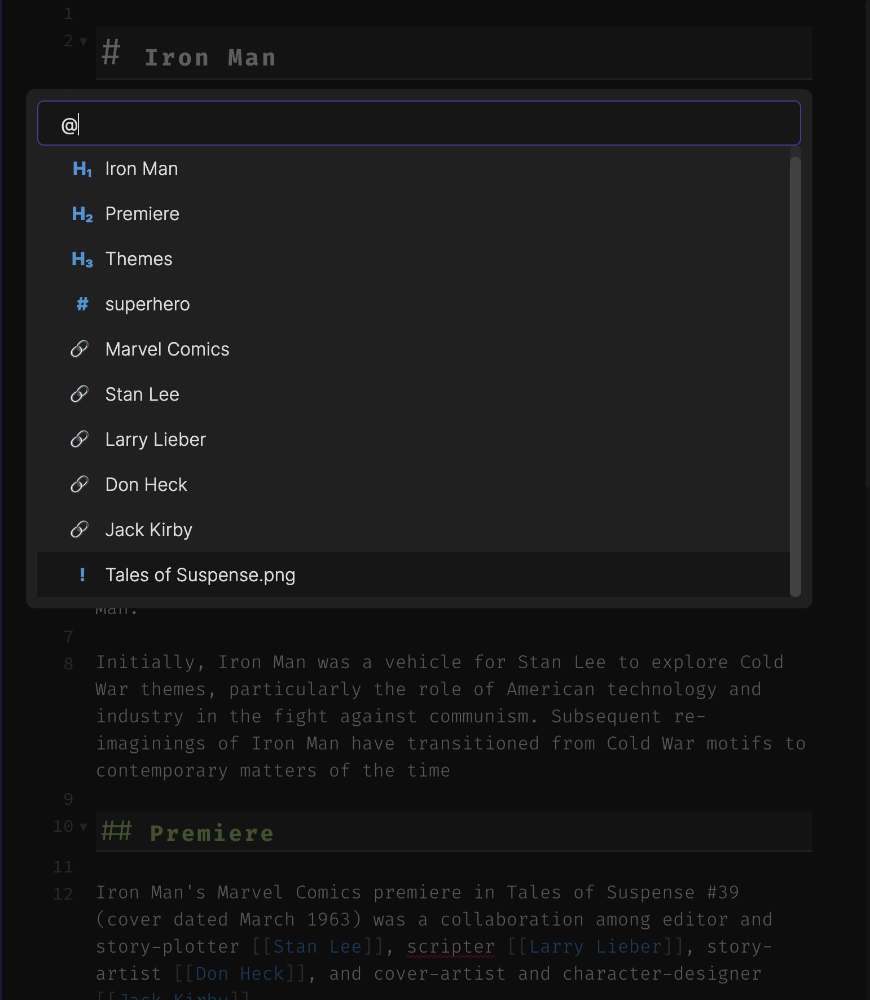

# obsidian-switcher-plus
Enhanced Quick Switcher plugin for [Obsidian.md](https://obsidian.md/)

## What does it do?

This plugin adds a few enhanced capabilities to the built in "Quick Switcher" functionality. These enhanced features are accessible via Obsidian global commands.

* View, filter, and navigate to any symbol (Headings, Hashtags, Links, Embedding) in a file directly from the Quick Switcher. This can be done for the currently open file using a global command, or for any file suggestion currently selected in the Quick Switcher by using the default `@` command. 
* View, and filter all of the currently open files (default Switcher only displays 5), and navigate to any of them from the Quick Switcher by using the default `edt ` command.
* The default builtin Quick Switcher behavior is used when no commands are present.

## How do I install it?

> This plugin uses the [volcano](https://github.com/kognise/volcano) unofficial plugin loader by [kognise](https://github.com/kognise/)
> The Volcano plugin system is UNOFFICIAL and UNSUPPORTED, use it at your own risk.

1. Install the [volcano plugin loader](https://github.com/kognise/volcano#installation)
2. Copy `dist/volcano/switcher-plus-volcano.js` to `~/volcano/plugins` on MacOS
3. Restart Obsidian
4. In the Settings panel, enable the `Quick Switcher++` plugin
5. The following global commands can then be mapped to hotkeys:
    * Open Quick Switcher++
    * Open Quick Switcher++ in Editor Mode
    * Open Quick Switcher++ in Symbol Mode

## Notes

* This plugin very much experimental at the moment, use it at your own risk. It's only been tested on MacOS, other platforms may have issues.
